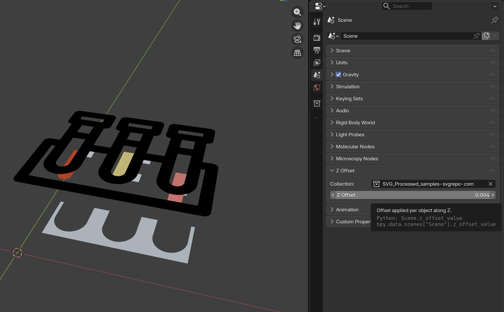

# Blender Enhanced SVG

Import more complex svgs to Blender as well!

Left: without preprocessing
Right: with preprocessing

# Changelog

Unreleased

* Import raster images embedded in the SVG (data URIs in `<defs>` or inline, plus external file references) as textured planes, placed to match the imported curves. Images are packed into the .blend, and get a diffuse or emission material (depending on the importer used) with the texture's color and alpha.
* Fix crash in the emission importer when a curve has an empty material slot

v0.2.0

Support for Blender 5.1

v0.1.8

* Add z offset panel

v0.1.7

* another try

v0.1.3

* Bump versions of dependencies
* automate workflow

v0.1.2

* Fix import error: https://github.com/kolibril13/blender_enhanced_svg/issues/1#issuecomment-3071963714